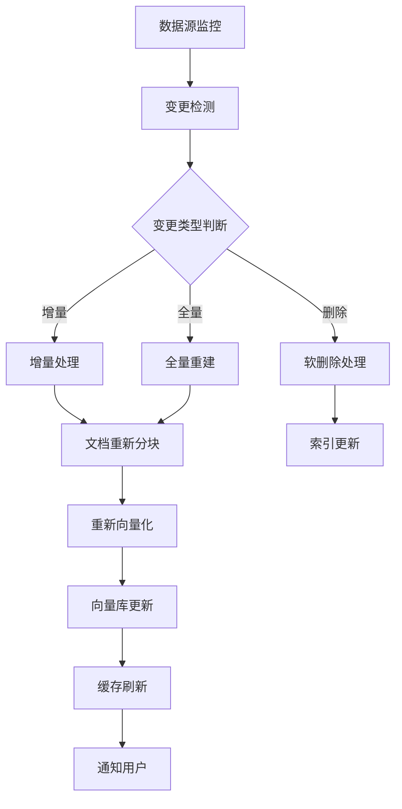

# 企业知识库更新策略与自动化方案

## 🔄 知识库更新需求分析

### 不同类型数据的更新频率需求

| 数据类型 | 更新频率 | 更新方式 | 影响程度 |
|----------|----------|----------|----------|
| **政策文档** | 月度/季度 | 手动触发 | 高 - 合规性关键 |
| **产品手册** | 版本发布时 | 自动触发 | 高 - 准确性关键 |
| **FAQ** | 周度 | 半自动 | 中 - 用户体验 |
| **技术文档** | 日度/周度 | 自动同步 | 高 - 开发效率 |
| **人事制度** | 变更时 | 手动审核 | 高 - 合规性 |
| **销售资料** | 实时 | 自动同步 | 中 - 时效性 |
| **客户案例** | 月度 | 半自动 | 低 - 参考价值 |
| **培训材料** | 季度 | 计划更新 | 中 - 知识传承 |

---

## 📊 更新策略建议

### 1. 实时更新 (Real-time)
**适用场景**: 价格信息、库存数据、系统状态
```
触发机制: API Webhook、数据库触发器
更新延迟: < 1分钟
技术方案: 流式处理、消息队列
```

### 2. 准实时更新 (Near Real-time)
**适用场景**: 客户数据、订单信息、日志数据
```
触发机制: 定时任务 (5-15分钟)
更新延迟: 5-15分钟
技术方案: 增量同步、Change Data Capture
```

### 3. 批量更新 (Batch)
**适用场景**: 报告文档、历史数据、归档资料
```
触发机制: 定时任务 (每日/每周)
更新延迟: 1-7天
技术方案: ETL流水线、全量/增量混合
```

### 4. 事件驱动更新 (Event-driven)
**适用场景**: 政策变更、产品发布、紧急通知
```
触发机制: 人工触发、系统事件
更新延迟: 即时
技术方案: 事件总线、通知系统
```

---

## 🤖 自动化更新技术方案

### 核心自动化架构



### 1. 文件系统监控
```python
# 实时文件监控示例
import asyncio
from watchdog.observers import Observer
from watchdog.events import FileSystemEventHandler

class DocumentMonitor(FileSystemEventHandler):
    def __init__(self, rag_system):
        self.rag_system = rag_system
        self.pending_updates = {}
    
    def on_modified(self, event):
        if not event.is_directory:
            # 防抖处理 - 避免频繁更新
            self.schedule_update(event.src_path)
    
    def schedule_update(self, file_path):
        # 5秒内多次修改只触发一次更新
        if file_path in self.pending_updates:
            self.pending_updates[file_path].cancel()
        
        self.pending_updates[file_path] = asyncio.create_task(
            self.delayed_update(file_path, delay=5)
        )
    
    async def delayed_update(self, file_path, delay=5):
        await asyncio.sleep(delay)
        await self.rag_system.update_document(file_path)
        del self.pending_updates[file_path]
```

### 2. 数据库变更捕获 (CDC)
```python
# PostgreSQL CDC监控
class DatabaseCDC:
    def __init__(self, rag_system):
        self.rag_system = rag_system
        self.replication_slot = "rag_updates"
    
    async def start_monitoring(self):
        # 创建逻辑复制槽
        await self.create_replication_slot()
        
        # 持续监听变更
        async for change in self.stream_changes():
            await self.process_change(change)
    
    async def process_change(self, change):
        if change.table in ['documents', 'faqs', 'policies']:
            if change.operation == 'INSERT':
                await self.rag_system.add_document(change.new_data)
            elif change.operation == 'UPDATE':
                await self.rag_system.update_document(change.new_data)
            elif change.operation == 'DELETE':
                await self.rag_system.remove_document(change.old_data['id'])
```

### 3. 智能更新调度器
```python
class IntelligentUpdateScheduler:
    def __init__(self):
        self.update_priorities = {
            'critical': 0,      # 立即更新
            'high': 300,        # 5分钟内
            'medium': 3600,     # 1小时内
            'low': 86400        # 24小时内
        }
    
    def classify_update_priority(self, document_info):
        """基于文档类型和内容变化判断优先级"""
        doc_type = document_info.get('type')
        change_size = document_info.get('change_percentage', 0)
        
        if doc_type in ['policy', 'compliance', 'security']:
            return 'critical'
        elif doc_type in ['product_manual', 'api_doc'] or change_size > 0.3:
            return 'high'
        elif doc_type in ['faq', 'knowledge_base']:
            return 'medium'
        else:
            return 'low'
    
    async def schedule_update(self, document_info):
        priority = self.classify_update_priority(document_info)
        delay = self.update_priorities[priority]
        
        if delay == 0:
            # 立即更新
            await self.update_immediately(document_info)
        else:
            # 延迟更新
            await self.schedule_delayed_update(document_info, delay)
```

---

## 📈 增量更新优化策略

### 1. 智能差异检测
```python
class SmartDiffDetector:
    def __init__(self):
        self.hash_cache = {}
        self.content_analyzer = ContentAnalyzer()
    
    async def detect_changes(self, document_id, new_content):
        """检测文档变更并分析影响范围"""
        old_hash = self.hash_cache.get(document_id)
        new_hash = self.calculate_content_hash(new_content)
        
        if old_hash == new_hash:
            return None  # 无变更
        
        # 获取旧内容
        old_content = await self.get_cached_content(document_id)
        
        # 分析变更类型和范围
        change_analysis = await self.analyze_changes(old_content, new_content)
        
        self.hash_cache[document_id] = new_hash
        return change_analysis
    
    async def analyze_changes(self, old_content, new_content):
        """分析变更的语义影响"""
        # 段落级别的变更检测
        old_chunks = self.content_analyzer.chunk_document(old_content)
        new_chunks = self.content_analyzer.chunk_document(new_content)
        
        changes = {
            'added_chunks': [],
            'modified_chunks': [],
            'deleted_chunks': [],
            'semantic_impact': 'low'  # low/medium/high
        }
        
        # 详细的差异分析逻辑
        # ...
        
        return changes
```

### 2. 渐进式重建策略
```python
class ProgressiveRebuildManager:
    def __init__(self, vector_db):
        self.vector_db = vector_db
        self.rebuild_queue = asyncio.Queue()
        self.batch_size = 100
    
    async def queue_document_update(self, document_id, priority='medium'):
        """将文档更新加入队列"""
        await self.rebuild_queue.put({
            'document_id': document_id,
            'priority': priority,
            'timestamp': time.time()
        })
    
    async def process_update_queue(self):
        """批量处理更新队列"""
        batch = []
        
        while True:
            try:
                # 收集一批待更新文档
                while len(batch) < self.batch_size:
                    update_item = await asyncio.wait_for(
                        self.rebuild_queue.get(), timeout=5.0
                    )
                    batch.append(update_item)
                
                # 按优先级排序
                batch.sort(key=lambda x: x['priority'])
                
                # 批量更新向量
                await self.batch_update_vectors(batch)
                batch.clear()
                
            except asyncio.TimeoutError:
                # 超时也处理已收集的文档
                if batch:
                    await self.batch_update_vectors(batch)
                    batch.clear()
```

---

## 🔍 更新质量监控

### 更新效果评估指标

```python
class UpdateQualityMonitor:
    def __init__(self):
        self.metrics = {
            'update_latency': [],      # 更新延迟
            'search_accuracy': [],     # 搜索准确率变化
            'user_satisfaction': [],   # 用户满意度
            'cache_hit_rate': [],      # 缓存命中率
        }
    
    async def evaluate_update_impact(self, update_batch):
        """评估更新对系统性能的影响"""
        before_metrics = await self.capture_baseline_metrics()
        
        # 执行更新
        await self.execute_updates(update_batch)
        
        # 等待系统稳定
        await asyncio.sleep(300)  # 5分钟
        
        after_metrics = await self.capture_metrics()
        
        # 分析影响
        impact_analysis = self.analyze_impact(before_metrics, after_metrics)
        
        # 如果质量下降超过阈值，触发回滚
        if impact_analysis['quality_score'] < 0.8:
            await self.trigger_rollback(update_batch)
        
        return impact_analysis
```

---

## 💡 实践建议

### 1. 更新频率规划

**高频更新数据 (实时-15分钟)**
- 产品价格、库存状态
- 系统状态、监控数据
- 紧急通知、公告

**中频更新数据 (小时-天级)**
- 技术文档、API文档
- FAQ、知识库条目
- 客户案例、最佳实践

**低频更新数据 (周-月级)**
- 政策制度、合规文档
- 培训材料、操作手册
- 历史数据、归档资料

### 2. 更新成本优化

```yaml
成本优化策略:
  计算资源:
    - 非峰值时段批量更新
    - GPU资源复用和调度
    - 增量处理减少计算量
  
  存储成本:
    - 版本管理和清理策略
    - 压缩和去重技术
    - 冷热数据分层存储
  
  人工成本:
    - 自动化监控和更新
    - 异常情况自动告警
    - 批量审核工具
```

### 3. 推荐更新策略

**阶段一 (系统建设期)**
- 每日批量更新
- 手动触发重要更新
- 基础监控和告警

**阶段二 (稳定运行期)**
- 智能增量更新
- 自动化流水线
- 完善的质量监控

**阶段三 (成熟优化期)**
- 实时流式更新
- AI辅助内容管理
- 预测性维护

总的来说，现代企业知识库需要**智能化的自动更新机制**，而不是依赖人工定期更新。重点是建立合适的自动化流水线，根据数据重要性和变更频率采用不同的更新策略。

您希望我详细展开哪个特定的更新场景或技术方案？
