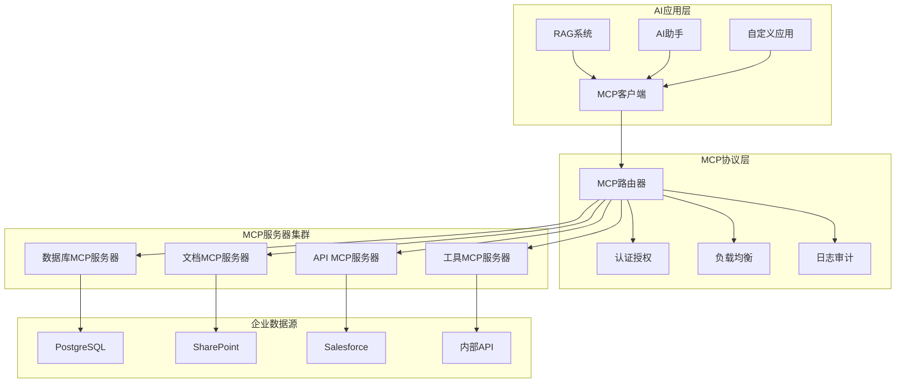

# MCP开源方案推荐与企业实施指南

## 🌟 MCP协议简介

Model Context Protocol (MCP)是Anthropic在2024年11月开源的标准协议，用于连接AI助手与数据存储系统，包括内容存储库、业务工具和开发环境。MCP就像AI应用的USB-C接口，提供了AI模型连接各种外围设备和配件的标准化方式。

---

## 🏆 官方核心MCP Servers

### 1. Anthropic官方服务器集合
**项目地址**: https://github.com/modelcontextprotocol/servers

#### 核心官方服务器
这些官方参考服务器展示了核心MCP功能：

- **Filesystem** - 具有可配置访问控制的安全文件操作
- **Fetch** - 为LLM使用优化的Web内容获取和转换
- **Memory** - 基于知识图谱的持久化内存系统
- **Sequential Thinking** - 通过思维序列进行动态问题解决

#### 归档服务器(参考用)
- **PostgreSQL** - 具有架构检查功能的只读数据库访问
- **SQLite** - 轻量级数据库访问
- **Git** - Git仓库操作

---

## 🌐 企业级MCP生态系统

### 2. 最全面的MCP服务器集合
**Awesome MCP Servers项目**: 目前收录了7260个MCP服务器

#### 主要集合项目
- https://github.com/punkpeye/awesome-mcp-servers
- https://github.com/wong2/awesome-mcp-servers  
- https://github.com/appcypher/awesome-mcp-servers
- https://github.com/TensorBlock/awesome-mcp-servers

### 3. 企业级数据库连接器

#### 数据库类MCP服务器
```yaml
PostgreSQL MCP:
  功能: 完整的PostgreSQL数据库访问
  特性: 安全查询、架构检查、连接池
  
MySQL MCP:
  功能: MySQL数据库集成
  特性: 读写操作、事务支持
  
MongoDB MCP:
  功能: NoSQL数据库访问
  特性: 文档查询、聚合操作
  
Trino MCP Server:
  功能: 分布式SQL查询引擎
  特性: 多数据源联邦查询
```

#### 云服务集成
```yaml
AWS MCP Servers:
  - S3存储访问
  - DynamoDB操作
  - Lambda函数调用
  
Azure MCP Servers:
  - Blob存储
  - CosmosDB访问
  - Functions集成
  
Alibaba Cloud DataWorks:
  功能: 阿里云数据工作台集成
  特性: 云资源操作、数据处理流水线
```

### 4. 文件系统与内容管理

#### 文档处理MCP服务器
```yaml
Filesystem MCP:
  功能: 安全的本地文件系统访问
  特性: 权限控制、路径限制、文件监控
  
SharePoint MCP:
  功能: 微软SharePoint集成
  特性: 文档检索、权限管理、版本控制
  
Notion MCP:
  功能: Notion数据库和页面访问
  特性: 内容检索、页面创建、数据库查询
  
Confluence MCP:
  功能: Atlassian Confluence集成
  特性: 页面搜索、内容提取、空间管理
```

### 5. 企业应用集成

#### 办公协作MCP服务器
包括Todoist的完整REST API实现、Trello集成用于处理看板和卡片

```yaml
Todoist MCP:
  功能: 任务管理系统集成
  特性: 项目管理、任务分配、进度跟踪
  
Trello MCP:
  功能: 看板管理集成
  特性: 卡片操作、列表管理、团队协作
  
Slack MCP:
  功能: 团队通信平台集成
  特性: 消息发送、频道管理、用户查询
  
Microsoft 365 MCP:
  功能: Office套件集成
  特性: Excel操作、Outlook邮件、Teams会议
```

#### CRM/ERP集成
```yaml
Salesforce MCP:
  功能: CRM系统集成
  特性: 客户数据、销售流程、报表生成
  
HubSpot MCP:
  功能: 营销自动化平台
  特性: 联系人管理、营销活动、分析报告
  
SAP MCP:
  功能: ERP系统集成
  特性: 业务流程、财务数据、供应链管理
```

### 6. 开发工具与DevOps

#### 开发环境MCP服务器
```yaml
GitHub MCP:
  功能: 代码仓库管理
  特性: 代码检索、PR管理、Issue跟踪
  
GitLab MCP:
  功能: DevOps平台集成
  特性: CI/CD管道、代码审查、项目管理
  
Docker MCP:
  功能: 容器化平台集成
  特性: 镜像管理、容器操作、日志查看
  
Kubernetes MCP:
  功能: 容器编排平台
  特性: 资源管理、应用部署、监控告警
```

---

## 🏢 企业级MCP架构设计

### 核心架构模式



### 安全架构设计

```yaml
安全层级:
  网络层:
    - VPN隧道
    - 防火墙规则
    - 网络隔离
  
  认证层:
    - JWT令牌
    - OAuth 2.0
    - LDAP集成
  
  授权层:
    - RBAC权限控制
    - 资源级权限
    - 审计日志
  
  数据层:
    - 传输加密(TLS)
    - 存储加密
    - 数据脱敏
```

---

## 🚀 企业实施方案

### Phase 1: 基础MCP环境搭建 (1-2周)

#### 1.1 官方MCP SDK安装
```bash
# Python SDK
pip install mcp

# TypeScript SDK  
npm install @modelcontextprotocol/sdk

# 官方服务器模板
git clone https://github.com/modelcontextprotocol/servers
```

#### 1.2 核心服务器部署
```yaml
# docker-compose.yml
version: '3.8'
services:
  mcp-filesystem:
    image: mcp/filesystem:latest
    volumes:
      - /enterprise/docs:/mcp/docs:ro
    environment:
      - MCP_ACCESS_ROOTS=/mcp/docs
  
  mcp-database:
    image: mcp/postgresql:latest
    environment:
      - POSTGRES_HOST=your-db-host
      - POSTGRES_USER=readonly_user
      - POSTGRES_PASSWORD=${DB_PASSWORD}
  
  mcp-router:
    image: mcp/router:latest
    ports:
      - "8080:8080"
    environment:
      - MCP_SERVERS=filesystem,database,custom-api
```

### Phase 2: 自定义MCP服务器开发 (2-4周)

#### 2.1 企业数据源连接器开发
```python
# 企业SharePoint连接器示例
from mcp import MCPServer
import asyncio

class SharePointMCPServer(MCPServer):
    def __init__(self):
        super().__init__("sharepoint-connector")
        self.register_tools()
    
    def register_tools(self):
        @self.tool("search_documents")
        async def search_documents(query: str, site: str = None) -> list:
            """在SharePoint中搜索文档"""
            # 实现SharePoint Search API调用
            results = await self.sharepoint_client.search(query, site)
            return [
                {
                    "title": doc.title,
                    "url": doc.url,
                    "content": doc.excerpt,
                    "modified": doc.last_modified,
                    "author": doc.author
                }
                for doc in results
            ]
        
        @self.tool("get_document_content")
        async def get_document_content(document_url: str) -> dict:
            """获取文档完整内容"""
            content = await self.sharepoint_client.get_content(document_url)
            return {
                "content": content.text,
                "metadata": content.metadata
            }

# 企业数据库连接器
class EnterpriseDBMCPServer(MCPServer):
    def __init__(self):
        super().__init__("enterprise-db")
        self.register_tools()
    
    def register_tools(self):
        @self.tool("safe_query")
        async def safe_query(sql: str, params: dict = None) -> list:
            """执行安全的数据库查询"""
            # SQL注入检查
            if not self._is_safe_sql(sql):
                raise ValueError("Unsafe SQL detected")
            
            # 权限检查
            if not self._check_permissions(sql):
                raise PermissionError("Insufficient permissions")
            
            return await self.db_pool.fetch(sql, params)
```

#### 2.2 MCP管理器开发
```python
class EnterpriseMCPManager:
    def __init__(self):
        self.servers = {}
        self.auth_service = AuthService()
        self.audit_logger = AuditLogger()
    
    async def register_server(self, server_name: str, server_instance):
        """注册MCP服务器"""
        self.servers[server_name] = server_instance
        await server_instance.start()
    
    async def route_request(self, user_context: dict, server_name: str, 
                          tool_name: str, **kwargs):
        """路由并执行MCP请求"""
        # 用户认证
        if not await self.auth_service.verify_user(user_context):
            raise AuthError("Authentication failed")
        
        # 权限检查
        if not await self.auth_service.check_permission(
            user_context, server_name, tool_name
        ):
            raise PermissionError("Access denied")
        
        # 审计日志
        await self.audit_logger.log_request(
            user_context['user_id'], server_name, tool_name, kwargs
        )
        
        # 执行请求
        server = self.servers[server_name]
        result = await server.call_tool(tool_name, **kwargs)
        
        # 记录结果
        await self.audit_logger.log_response(
            user_context['user_id'], result
        )
        
        return result
```

### Phase 3: 企业集成与安全加固 (2-3周)

#### 3.1 认证授权集成
```python
# 企业AD/LDAP集成
class EnterpriseAuthService:
    def __init__(self):
        self.ldap_client = LDAPClient()
        self.jwt_service = JWTService()
    
    async def authenticate_user(self, username: str, password: str):
        """企业用户认证"""
        # LDAP认证
        user_info = await self.ldap_client.authenticate(username, password)
        if not user_info:
            raise AuthError("Invalid credentials")
        
        # 生成JWT令牌
        token = self.jwt_service.generate_token({
            'user_id': user_info.id,
            'username': username,
            'department': user_info.department,
            'roles': user_info.roles
        })
        
        return token
    
    async def check_resource_permission(self, user_context: dict, 
                                      resource: str, action: str):
        """检查资源权限"""
        user_roles = user_context.get('roles', [])
        department = user_context.get('department')
        
        # 基于角色的权限检查
        permissions = await self.get_role_permissions(user_roles)
        
        # 基于部门的数据访问控制
        if not await self.check_department_access(department, resource):
            return False
        
        return f"{resource}:{action}" in permissions
```

#### 3.2 监控与运维
```python
# MCP系统监控
class MCPMonitoringService:
    def __init__(self):
        self.metrics_collector = MetricsCollector()
        self.alert_manager = AlertManager()
    
    async def collect_metrics(self):
        """收集系统指标"""
        metrics = {
            'server_status': await self.check_server_health(),
            'request_latency': await self.measure_latency(),
            'error_rate': await self.calculate_error_rate(),
            'resource_usage': await self.get_resource_usage()
        }
        
        await self.metrics_collector.record(metrics)
        await self.check_alerts(metrics)
    
    async def check_alerts(self, metrics: dict):
        """检查告警条件"""
        if metrics['error_rate'] > 0.05:  # 5%错误率告警
            await self.alert_manager.send_alert(
                "High error rate detected",
                metrics
            )
        
        if metrics['request_latency'] > 5.0:  # 5秒延迟告警
            await self.alert_manager.send_alert(
                "High latency detected", 
                metrics
            )
```

---

## 📊 推荐实施策略

### 分阶段部署建议

| 阶段 | 持续时间 | 主要工作 | 交付物 |
|------|----------|----------|--------|
| **Phase 1** | 1-2周 | 环境搭建+官方服务器部署 | 基础MCP环境 |
| **Phase 2** | 2-4周 | 自定义连接器开发 | 企业数据源集成 |
| **Phase 3** | 2-3周 | 安全集成+监控部署 | 生产就绪系统 |
| **Phase 4** | 1-2周 | 测试优化+用户培训 | 正式上线运行 |

### 技术选型建议

#### 编程语言选择
- **Python**: 官方支持最完整，生态最丰富
- **TypeScript**: Web集成友好，开发效率高  
- **Go**: 高性能需求，云原生部署

#### 部署架构选择
- **单机部署**: 小规模企业(<100用户)
- **集群部署**: 中大型企业(100-1000用户)
- **云原生**: 大型企业(>1000用户)

### 成本预估

```yaml
开发成本:
  人力: 3-5人团队 × 2-3个月
  基础设施: 中等配置服务器集群
  第三方服务: MCP生态组件许可证

运营成本:
  服务器资源: 月度云服务/硬件折旧
  维护人力: 1-2人运维团队
  扩展开发: 持续功能迭代
```

---

## 🎯 最佳实践建议

### 1. 安全最佳实践
- 最小权限原则：每个MCP服务器只授予必要权限
- 网络隔离：MCP服务器部署在独立网段
- 数据加密：所有传输和存储数据加密
- 审计日志：完整的访问和操作日志

### 2. 性能优化
- 连接池：数据库连接复用
- 缓存策略：频繁访问数据缓存
- 异步处理：非阻塞I/O操作
- 负载均衡：多实例分布式部署

### 3. 运维管理
- 健康检查：自动服务状态监控
- 故障转移：高可用架构设计
- 版本管理：灰度发布和回滚机制
- 文档管理：完整的运维文档

MCP作为2024年11月由Anthropic推出的开放标准，已经被OpenAI和Google DeepMind等主要AI提供商采用，是构建企业级AI系统集成的最佳选择。

